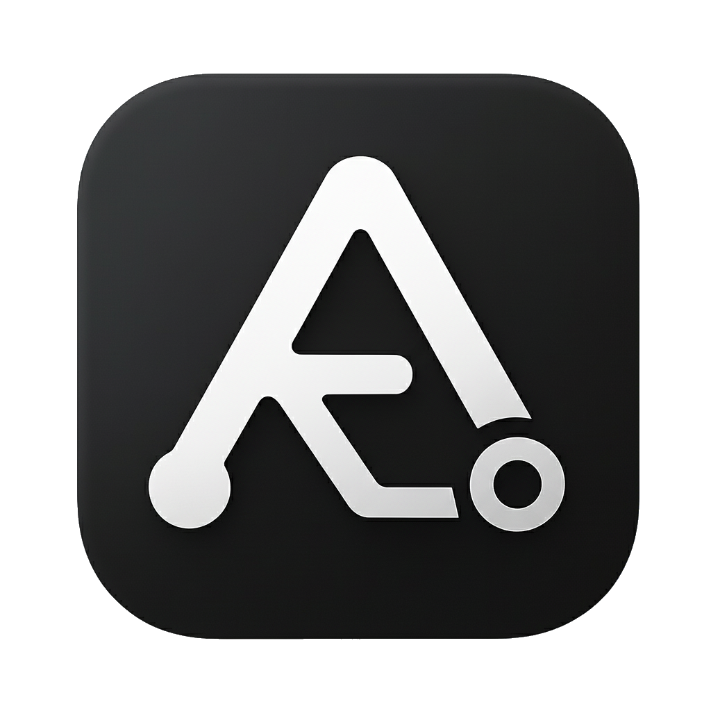

<p align="center">
  
</p>

# Aigit — Live code collaboration + manual checkpoints

Aigit makes remote work feel local. It streams live code updates with concise summaries to teammates on other machines, and also lets you create manual, restorable checkpoints without touching your normal branch history. Live updates auto‑apply; checkpoints are local by default and only shared when you explicitly push them.

## Features

- Live remote = local: edits on machine C are applied live on machine D (and vice versa) with summaries in the terminal.
- Manual checkpoints: restorable snapshots under `refs/aigit/checkpoints/<branch>`, not auto‑shared.
- Mid‑merge safe: checkpoint during merges; conflict info is preserved in metadata; `status` shows conflicted paths.
- Summaries: AI via OpenRouter (`openai/gpt-oss-20b:free`) or diff fallback.
- Autostart + idle: watcher starts after first aigit command; auto‑stops after 30 minutes without local edits.

## Install

```sh
# Option 1: go install
go install github.com/ReyNeill/aigit@latest

# Option 2: Homebrew
brew update && brew tap ReyNeill/homebrew-tap && brew install aigit && aigit version

# Option 3: build (downloading repo)
go build

# If `aigit` is not found after go install, ensure Go bin is on PATH:
# zsh
echo 'export PATH="$(go env GOPATH)/bin:$PATH"' >> ~/.zshrc && source ~/.zshrc
# bash
echo 'export PATH="$(go env GOPATH)/bin:$PATH"' >> ~/.bashrc && source ~/.bashrc
```

This produces an `aigit` binary.

## Quick Start (Intended Use)

1) Set your OpenRouter API key (optional but recommended):

- Add to `~/.zshrc` or `~/.bashrc`

```sh
export OPENROUTER_API_KEY="sk-or-v1-..."
```

Reload your shell or open a new terminal.

2) Enable live terminal updates:

- For zsh:
```
aigit init-shell --zsh
# then follow the printed instruction to add a single `source` line to ~/.zshrc or ~/.bashrc
```

3) In a Git repo, run any `aigit` command (e.g., `aigit status`). The watcher autostarts; live updates (summaries + applies) pop up in your terminal while you work. Stop with `aigit stop`.

4) Edit and save a file. You’ll see:

```
Detected changes; live checkpoints activated.
Live: <sha>  (<summary>)
```

Notes
- The shell integration runs a lightweight background follower per repository, printing new events as they arrive.
- Prefer a second pane with `aigit tail` if you want a dedicated continuous view.

## Note: You can teach LLMs how to use aigit pasting them the LLM.txt file!

## Commands

- `aigit status` — last checkpoint summary + diffstat vs HEAD.
- `aigit version` — print the version (set by GoReleaser in releases).
- `aigit id` — show your computed user id and the local/remote ref mapping.
- `aigit checkpoint -m "msg"` — manual snapshot (custom summary). Not auto‑shared.
- `aigit checkpoint push [-remote origin]` — share manual checkpoints to the remote per‑user namespace.
- `aigit list [-n 20] [--meta]` — list recent checkpoints for this branch.
- `aigit restore <sha>` — restore files from a checkpoint into the worktree.
- `aigit watch` — manual start of the watcher (auto‑started on first use; default interval 5m; idle auto‑stop 30m).
- `aigit stop` — stop the background watcher for the current repository.
- `aigit sync pull [-remote origin]` — fetch checkpoint refs from the remote (manual; usually not needed).
- `aigit remote-list [--remote origin] [--user id] [-n 20] [--meta]` — list users with checkpoints, or show a user's remote checkpoints for the current branch.
- `aigit apply --from <user> [--remote origin] [--sha <sha>]` — apply a remote user’s checkpoint to your worktree (latest if `--sha` omitted).
- `aigit events -id <session> [--follow]` — internal helper used by the shell integration to stream new events.
  - Tip: to avoid duplicate local echo when you also have shell integration, use `aigit checkpoint -q`.

## Configuration (git config)

Set per‑repo in `.git/config` or globally with `--global`.

- `aigit.summary` — `ai` (default) | `diff` | `off`
- `aigit.summaryModel` — default `openai/gpt-oss-20b:free`
- `aigit.interval` — live update cadence when active (e.g., `30s`, `2m`, `1h`)
  - Default: `5m`. Example: `git config aigit.interval 2m`
- `aigit.settle` — debounce window after saves (default `1.5s`)
- `aigit.user` — override your user id for remote namespaces (defaults to `user.email`)
  - By default, Aigit uses your `git user.email` as the user id (safe for ref names). You can override via `aigit.user`.

Live collaboration (defaults):

- `aigit.pushRemote` — remote for live updates (defaults to `origin` if present)
- `aigit.pullRemote` — remote to fetch live updates from (defaults to `origin` if present)
- `aigit.autoApply` — `true|false` enable auto‑apply of live updates (default true)
- `aigit.autoApplyFrom` — comma list of user ids or `*` for all (excluding yourself)

Manual checkpoints (opt‑in share): use `aigit checkpoint push [-remote origin]` when you want to share.

## Remote Namespace

Your manual checkpoints live at `refs/aigit/checkpoints/<branch>`.

When pushing, Aigit maps them to a per‑user namespace on the remote:

```
refs/aigit/users/<user>/checkpoints/<branch>
```

When pushing, Aigit maps them to a per‑user namespace on the remote:

```
refs/aigit/users/<user>/checkpoints/<branch>
```

Fetching pulls these into local tracking refs under:

```
refs/remotes/<remote>/aigit/users/<user>/checkpoints/<branch>
```

You can list and apply manual checkpoints using `aigit remote-list` and `aigit apply`.

Live updates use a separate namespace:

```
local:  refs/aigit/live/<branch>
remote: refs/aigit/users/<user>/live/<branch>
track:  refs/remotes/<remote>/aigit/users/<user>/live/<branch>
```

## Why It’s Different
 - Remote work feels local: Live updates stream between machines and auto‑apply.
 - Clean history: Manual checkpoints don’t touch `refs/heads/<branch>`.
 - Mid‑merge safe: Snapshot the working files (including conflict markers) via a temporary index.
 - No HEAD moves: Restore files from any checkpoint without moving `HEAD`.

## How It Works
- On save, Aigit builds a snapshot using a temporary Git index (leaves your index alone).
- Creates a tree and commit via `git commit-tree`.
- Live updates go to `refs/aigit/live/<branch>` and are pushed/pulled/applied automatically.
- Manual checkpoints go to `refs/aigit/checkpoints/<branch>` and are shared only via `aigit checkpoint push`.
- Summaries come from OpenRouter (or a diff heuristic fallback).

## Requirements
- Git ≥ 2.23 (uses `git restore`; falls back to `checkout` when needed)
- Go ≥ 1.21 to build from source
- macOS, Linux, or Windows

## Privacy & Security
- No telemetry.
- AI summaries call OpenRouter only when enabled. Keep `OPENROUTER_API_KEY` in your shell rc (e.g., `~/.zshrc`, `~/.bashrc`).

## Troubleshooting
- Missing remote on push: `git remote add origin <url>` then `aigit checkpoint push`.
- Status shows nothing: You’ll see “nothing here yet, clean workspace” on a clean tree.
 - Watcher didn’t start: Run `aigit status` once; ensure files are saved to trigger activation.
- macOS heavy projects: Increase settle window: `aigit watch -settle 3s` or `git config aigit.settle 3s`.
- OpenRouter key missing: Aigit falls back to diff‑based summaries.
 - Homebrew on pre‑release macOS: If Xcode/CLT mismatch errors appear, use `go install github.com/ReyNeill/aigit@latest` until CLT updates.

## Testing

Run the test suite:

```
go test
```

By default, AI summary tests call OpenRouter (requires `OPENROUTER_API_KEY`). To run without network, pass `-offline` to use a local fake. To skip AI tests entirely, use `-no_summary`. Tests run in temp repos and won’t affect your working repo.

```
go test                    # requires OPENROUTER_API_KEY for AI tests
go test -offline           # run AI tests with local fake (no network)
go test -no_summary        # skip AI tests entirely
```

## Merge‑Friendly

Checkpoints work during merges because Aigit builds a tree from a temporary index and snapshots the working files (including conflict markers). `aigit status` shows a preview of conflicted paths.

## Notes & Limits

- Aigit does not move `HEAD`. It writes separate checkpoint commits and updates an internal ref.
- Checkpoints include all files (tracked or previously untracked) in your worktree.
- For team sync, ensure your remote allows pushing custom refs (most hosts do). The first manual checkpoint share may require `aigit checkpoint push`.
- Auto‑apply writes files into your working tree. Enable it only if you want live updates from selected users.

## For Agents

If you’re using an AI coding agent, share the `LLM.txt` file. It explains Aigit’s model, guardrails, and the exact commands to use (checkpoint, list, restore, status, checkpoint push/apply), including merge‑time behavior and summary style.

## License

MIT

## Release & CI

- CI (offline tests) runs on pushes/PRs.
- Optional online AI tests run if you add a repository secret `OPENROUTER_API_KEY`.
- Releases: Tag with `vX.Y.Z` to trigger GoReleaser and publish archives.
- Homebrew tap: Create `https://github.com/ReyNeill/homebrew-tap` and add a repo secret `BREW_GITHUB_TOKEN` (a Personal Access Token with `repo` scope). The release action uses it to publish the formula to your tap.
